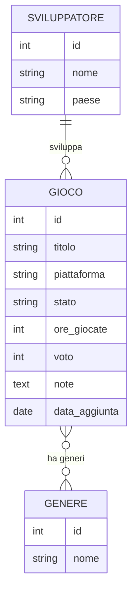

# Django Game Backlog

Backend in **Python / Django** con **Django REST Framework** per gestire un backlog di videogiochi: cosa hai da giocare, cosa stai giocando, cosa hai finito, con voto, ore giocate, sviluppatore e generi.

Il progetto espone sia un'**API REST** (con serializer, viewset, router e autenticazione a token) sia alcune **pagine server-side** con template Django, ed è completamente gestibile dal **pannello di amministrazione** di Django.

---

## Requisiti

- **Python ≥ 3.12** (il progetto è sviluppato e testato su 3.14)
- **[uv](https://docs.astral.sh/uv/)** come gestore di ambiente e pacchetti

Non serve installare le dipendenze a mano: sono dichiarate in `pyproject.toml` e bloccate in `uv.lock`. Il comando `uv sync` ricostruisce l'ambiente identico.

---

## Installazione e avvio

Partendo da zero, dopo aver clonato il repository:

```bash
git clone https://github.com/Barbagallo2296/django-game-backlog.git
cd django-game-backlog

# 1. ricostruisce l'ambiente virtuale e installa le dipendenze dal lockfile
uv sync

# 2. crea le tabelle del database (SQLite, generato in locale)
uv run python manage.py migrate

# 3. carica i dati di esempio (giochi, sviluppatori, generi con relazioni)
uv run python manage.py loaddata esempio

# 4. crea un utente amministratore (scegli username e password)
uv run python manage.py createsuperuser

# 5. avvia il server di sviluppo
uv run python manage.py runserver
```

Il server sarà disponibile su **http://127.0.0.1:8000/**.

> **Nota sul database:** il file `db.sqlite3` **non** è versionato (è nel `.gitignore`), quindi ogni sviluppatore parte da un database vuoto e lo popola con i passi 2–3.

---

## Come provare il backend

### Pagine web
- **http://127.0.0.1:8000/** — lista dei giochi (pagina server-side)
- **http://127.0.0.1:8000/admin/** — pannello di amministrazione (login con il superuser creato)

### API REST (browsable)
- **http://127.0.0.1:8000/api/** — indice delle API navigabile dal browser
- **http://127.0.0.1:8000/api/giochi/** — lista/creazione giochi
- **http://127.0.0.1:8000/api/giochi/statistiche/** — statistiche aggregate (totale giochi, ore totali, voto medio, conteggio per stato)

---

## Autenticazione a token

Le operazioni di **sola lettura** (GET) sono pubbliche; le operazioni di **scrittura** (POST, PUT, PATCH, DELETE) richiedono un utente autenticato tramite **token**.

### Ottenere un token

Due modi, a scelta.

**A) Da riga di comando** (per un utente già esistente):

```bash
uv run python manage.py drf_create_token <username>
```

**B) Via API**, inviando le credenziali:

```bash
curl -X POST http://127.0.0.1:8000/api/token/ -d "username=<username>&password=<password>"
```

La risposta contiene il token:

```json
{ "token": "xxxxxxxxxxxxxxxxxxxxxxxxxxxxxxxxxxxxxxxx" }
```

### Usare il token

Il token va inviato nell'header `Authorization` a ogni richiesta di scrittura:

```bash
curl -X POST http://127.0.0.1:8000/api/giochi/ \
  -H "Content-Type: application/json" \
  -H "Authorization: Token IL_TUO_TOKEN" \
  -d '{"titolo":"Sekiro","piattaforma":"PC","stato":"FINITO","voto":10}'
```

Senza token, la stessa richiesta restituisce `401 Unauthorized`.

> Il token è una credenziale: non va incollato nel codice né nel repository.

---

## Endpoint principali

| Metodo | Endpoint | Descrizione | Auth |
|---|---|---|---|
| GET | `/api/giochi/` | Lista giochi | No |
| POST | `/api/giochi/` | Crea gioco | Sì |
| GET | `/api/giochi/{id}/` | Dettaglio gioco | No |
| PUT / PATCH | `/api/giochi/{id}/` | Modifica gioco | Sì |
| DELETE | `/api/giochi/{id}/` | Elimina gioco | Sì |
| GET | `/api/giochi/statistiche/` | Statistiche aggregate | No |
| GET / POST | `/api/sviluppatori/` | Lista / crea sviluppatori | GET no, POST sì |
| GET / POST | `/api/generi/` | Lista / crea generi | GET no, POST sì |
| POST | `/api/token/` | Ottieni token da credenziali | No |

---

## Modello dati

Tre modelli con due tipi di relazione:

- **`Gioco`** — il modello centrale (titolo, piattaforma, stato, ore giocate, voto, note, data di aggiunta).
- **`Sviluppatore`** — collegato a `Gioco` con una **ForeignKey** (uno-a-molti: un gioco ha uno sviluppatore, uno sviluppatore ha molti giochi).
- **`Genere`** — collegato a `Gioco` con una relazione **ManyToMany** (un gioco ha più generi, un genere appartiene a più giochi).

La gestione utenti usa il modello `User` integrato di Django (nessun modello utente custom).



---

## Amministrazione

Il pannello Django (`/admin/`) gestisce tutti i modelli, con personalizzazioni:
- colonne in elenco (`list_display`)
- filtri laterali per stato, piattaforma e genere (`list_filter`)
- ricerca per titolo (`search_fields`)
- selettore comodo per i generi (`filter_horizontal`)

---

## Funzionalità da sviluppare in futuro

- **Paginazione e filtri** sugli endpoint API (es. filtrare i giochi per stato o piattaforma via query string).
- **Autenticazione JWT** (con `djangorestframework-simplejwt`) come alternativa al token semplice, con scadenza e refresh.
- **Serializer annidati** per mostrare i dettagli completi di sviluppatore e generi (non solo gli id) nelle risposte.
- **Interfaccia frontend** separata (es. React) che consuma l'API.
- **Deploy** con database PostgreSQL al posto di SQLite.
- **Test automatici** per API e modelli.

---

## Riferimenti utili

- [Django](https://www.djangoproject.com/) — [documentazione 6.0](https://docs.djangoproject.com/en/6.0/)
- [Django REST Framework](https://www.django-rest-framework.org/)
  - [Serializers](https://www.django-rest-framework.org/api-guide/serializers/)
  - [ViewSets](https://www.django-rest-framework.org/api-guide/viewsets/)
  - [Routers](https://www.django-rest-framework.org/api-guide/routers/)
  - [Authentication](https://www.django-rest-framework.org/api-guide/authentication/)
- [uv](https://docs.astral.sh/uv/) — gestore di ambiente e pacchetti

---

## Stack tecnico

Python · Django 6.0 · Django REST Framework · SQLite · uv